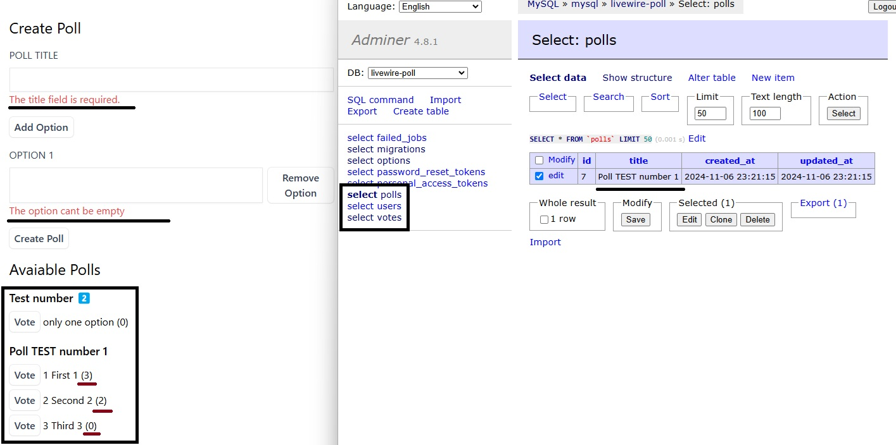

# Pablo Paez 🦝 - LARAVEL - TASK LIST 💻

 

  

# El Proyecto⭐ / The Project🌟

  

⭐ El proyecto es parte del portfolio de proyectos de LARAVEL, en esto caso una aplicacion donde se crean Encuestas junto con todas sus posibles opciones para ser votadas, en esta misma apicacion veremos las encuestas y podremos votar en ellas. Al mismo tiempo, todos los datos de esta aplicacion seran guardadas en una base de datos (Enecuestas, Votos, Usuarios , Etc)
 
🌟 The project is part of the LARAVEL project portfolio, specifically an application where surveys are created along with all their possible voting options. Within the same application, we can view the surveys and cast votes. Simultaneously, all data from this application will be stored in a database (Surveys, Votes, Users, etc.).

### Tecnologias utilizadas: / Technologies used:

PHP - LARAVEL - TAILWIND / SQL - DOCKER DESKTOP

Tambien se usaron conocimientos en: / Furthermore, expertise in this technologies was utilized: 

    - REAL-TIME APPLICATIONS WITH LIVEWIRE
    - COMPONENT-BASED ARCHITECTURE
    - STATE MANAGEMENT IN LIVEWIRE
    - EVENT HANDLING BETWEEN COMPONENTS
    
<!-- LINKS -->
### Contacto📩 / Contact📩

Pablo Paez - Desarrollador Web - pablopaez2307@gmail.com

[![LinkedIn][linkedin-shield]][linkedin-url]

[linkedin-shield]: https://img.shields.io/badge/-LinkedIn-black.svg?style=for-the-badge&logo=linkedin&colorB=555
[linkedin-url]: https://www.linkedin.com/in/pablo-paez-t/
